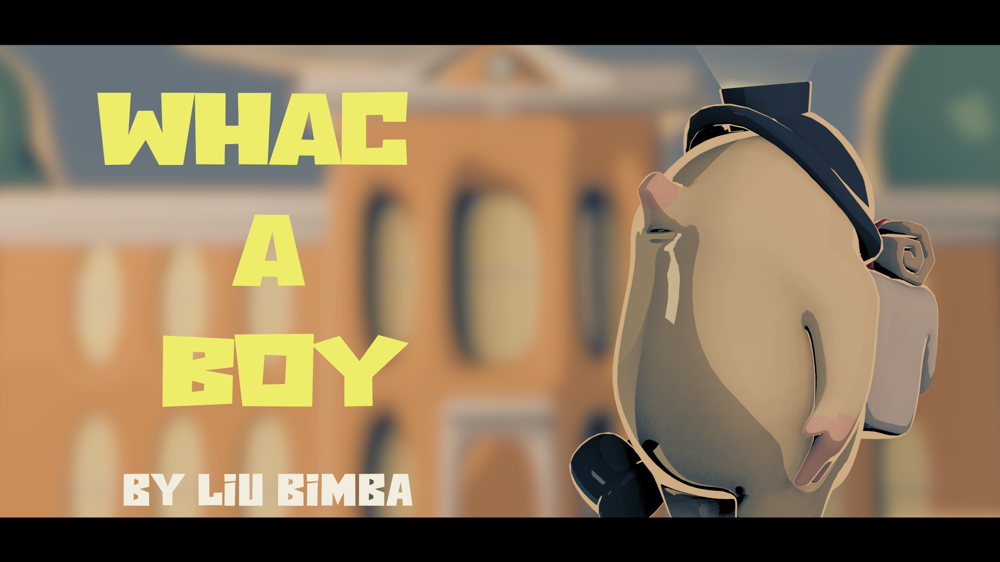

Whac A Boy
==========

Игра для устройств на платформе Android, вдохновленная классикой старых времен "Ударь крота" (Whac-A-Mole). Только теперь мы играем за крота, который выступает в роли главного героя и следит за поведением детей в школе во время урока.\
\
P.S. Или же он просто мстит своим обидчикам, которые так много раз били его по голове.

Softwares
---------


Unity3D
-------------
*-Логика игры*\
*-3 Уровня сложности*\
*-Shading*\
*-Модуль для Android Studio, который используется как Activity самой игры*
  
Blender
-----------

*-Моделирование персонажей и обьектов*\
*-Level Design*\
*-Shading*\
*-Анимация для начального меню и меню результата игры*\
*-Создание Splash окна между переходами разными Activity*\

Android Studio
-----------

*-ExoPlayer использовал в качестве проигрывателя видео, которое запускается при нажатии на кнопку ```LEVEL```,\
а при нажатии на ```BACK``` проигрывается реверснутое видео*\
*-Начальный экран и экран результата игры*\
*-Модуль для общения между Activity Android и Activity Unity3D*\
*-Сервис для проигрывания музыки*

GamePlay
===========
<a href="https://youtu.be/lf6Qf8Lmblc" target="_blank"></a>

Questions
---------

-Почему я не написал игру полностью на Unity3D? Начальное меню и меню результата добавил костылями в Android Studio, а не прописал отдельные Screen-ы в Unity3D.\
-Хотелось поработать в нескольких программах. Конечно, логичнее было разработать игру на одной платформе, поскольку как таковых нативных функции Android я не использовал при создании игры, чтобы совмещать эти две платформы, но поскольку я обучаюсь, то это самый обычный порыв любопытства.

