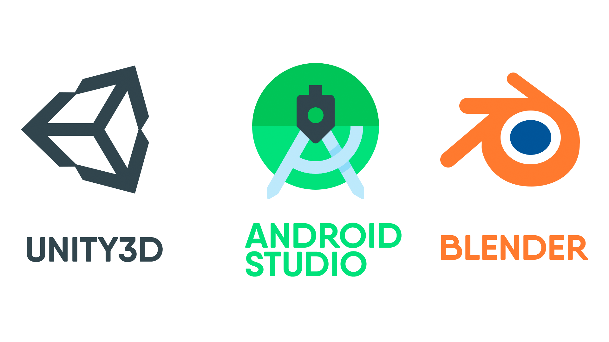

Whac A Boy
==========

Игра в стиле "Ударь крота". 

Softwares
---------



Unity3D
-------------
*-Логика игры*\
*-3 Уровня сложности*\
*-Shading*\
*-Модуль для Android Studio, который использовал как Activity самой игры*
  
Blender
-----------

*-Моделирование персонажей и обьектов*\
*-Level Design*\
*-Shading*\
*-Анимация для начального меню и меню результата игры*\
*-Создание Splash окна между переходами разными Activity*\

Android Studio
-----------

*-ExoPlayer использовал в качестве проигрывателя видео, которое запускается при нажатии на кнопку ```LEVEL```,\
а при нажатии на ```BACK``` проигрывается реверснутое видео*\
*-Начальный экран и экран результата игры*

GamePlay
===========
<a href="https://youtu.be/lf6Qf8Lmblc" target="_blank"></a>


